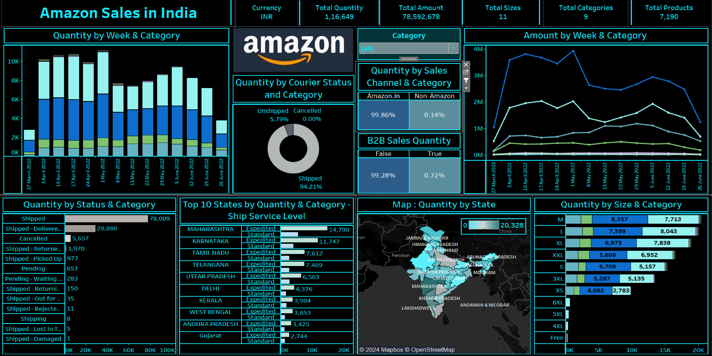

# **Amazon Sales Performance Dashboard 2022**  
### **Interactive Insights for Strategic Sales Growth**  

---

## **Overview**  
The **Amazon Sales Performance Dashboard** is an interactive Tableau visualization that delivers actionable insights into Amazon's sales trends. Designed for stakeholders, it highlights key sales metrics, performance trends, and growth opportunities to enable **data-driven decision-making**.

---

## **Dashboard Snapshot**  

  
*Figure: Interactive Tableau Dashboard showcasing key sales metrics and trends*  

---

## **Key Metrics**  
- **Total Sales Quantity**: 1,16,649  
- **Total Sales Amount**: ₹7,85,92,678  
- **Total Sizes**: 11  
- **Total Categories**: 9  
- **Total Products**: 7,190  

---

## **Dashboard Features**  

1. **Sales Overview**:  
   - Total Sales Quantity and Sales Amount displayed prominently for quick assessment.  

2. **Weekly Trends**:  
   - Bar and line charts to analyze **sales quantity** and **amount trends** (27 March 2022 - 26 June 2022).  

3. **Category & Channel Insights**:  
   - **Courier Status**: 94.21% shipped, 5.79% unshipped.  
   - **Sales Channels**: Heatmap shows **99.86% Amazon** dominance.  
   - **B2B vs. B2C Sales**: 99.28% non-B2B sales.  

4. **User-Centric Design**:  
   - Interactive, intuitive visuals that simplify complex data for informed decision-making.

---

## **Insights**  

1. **Channel Dominance**:  
   - Sales heavily reliant on **Amazon** (99.86%).  

2. **Logistics Excellence**:  
   - High shipping success rate (**94.21%**) ensures customer satisfaction.  

3. **Category Performance**:  
   - High-performing categories identified for strategic focus.  

4. **Weekly Sales Patterns**:  
   - Peak periods highlight optimal campaign opportunities.  

5. **B2B Growth Potential**:  
   - B2B sales (0.72%) offer untapped market opportunities.

---

## **Strategic Recommendations**  

1. **Leverage Core Channels**:  
   - Prioritize resources to strengthen **Amazon** dominance.  

2. **Optimize Logistics**:  
   - Maintain and improve shipping efficiencies.  

3. **Drive Peak Sales Campaigns**:  
   - Use weekly sales trends to optimize campaign timing.  

4. **Expand B2B Market**:  
   - Target initiatives to grow B2B sales while sustaining B2C success.  

5. **Refine Category Focus**:  
   - Invest in high-performing categories and reallocate resources from underperforming ones.

---

## **Why This Dashboard Matters**  
- **Interactive Visuals**: Enables clear, actionable insights.  
- **Real Business Impact**: Directly addresses sales growth strategies.  
- **Professional Design**: Showcases Tableau expertise and storytelling capabilities.  

---

**Pro Tip**: Future iterations can integrate **predictive analytics** to forecast sales trends and further enhance strategic planning.

