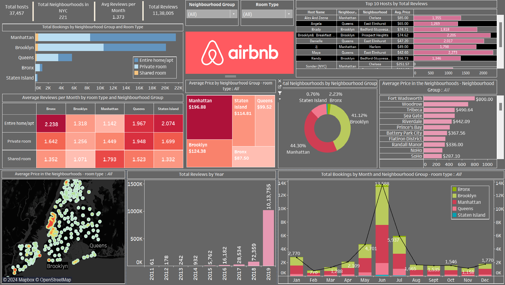

# **Airbnb New York City Market Dashboard**  
### **Deep-Dive Analysis and Strategic Insights for Enhanced Airbnb Performance**  

---

## **Overview**  
The **Airbnb New York City Market Dashboard** is an immersive Tableau visualization that provides comprehensive insights into Airbnb activity across New York City. It is crafted for stakeholders aiming to understand key metrics, performance trends, and growth opportunities, thereby driving **data-informed strategic decisions**.

---

## **Dashboard Snapshot**  

  
*Figure: Interactive Tableau Dashboard showcasing key metrics and trends for Airbnb listings in New York City*  

---

## **Key Metrics**  
- **Total Hosts**: 37,457  
- **Total Neighborhoods in NYC**: 221  
- **Average Reviews per Month**: 1.373  
- **Total Reviews**: 11,380,005  

---

## **Dashboard Features**  

1. **Total Bookings by Neighborhood Group and Room Type**:  
   - Segmentation by **Neighborhood Groups**: Manhattan, Brooklyn, Queens, Bronx, Staten Island  
   - Segmentation by **Room Types**: Entire home/apt, Private room, Shared room  

2. **Average Reviews per Month by Room Type and Neighborhood Group**:  
   - Detailed breakdown of review rates across different room types and neighborhoods.  

3. **Average Price by Neighborhood Group**:  
   - Pricing insights across **Manhattan, Brooklyn, Staten Island, Queens,** and **Bronx**.  

4. **Total Neighborhoods by Neighborhood Group**:  
   - Distribution of neighborhoods within each major area of NYC.  

5. **Average Price in the Neighborhoods**:  
   - Highlighting the most and least expensive neighborhoods.  

6. **Total Reviews by Year**:  
   - Historical trend analysis of reviews from **2011 to 2019**.  

7. **Total Bookings by Month and Neighborhood Group**:  
   - Monthly booking trends within each neighborhood group.  

8. **Top 10 Hosts by Total Reviews**:  
   - Identification of hosts with the highest number of reviews.

---

## **Insights**  

1. **Neighborhood Group Dynamics**:  
   - **Manhattan** and **Brooklyn** are the most active areas for Airbnb listings.  

2. **Review Activity**:  
   - Higher review rates for entire homes/apt and private rooms.  

3. **Pricing Variations**:  
   - **Manhattan** has the highest average prices, followed by **Brooklyn** and **Staten Island**.  

4. **Neighborhood Distribution**:  
   - Significant concentration of listings in **Manhattan** and **Brooklyn**.  

5. **Historical Trends**:  
   - Rapid growth in review activity from **2011 to 2019**.  

6. **Monthly Booking Trends**:  
   - Peaks in **June** and **May** suggesting optimal booking periods.  

7. **Top Hosts**:  
   - Identifying high-performing hosts like **Alex And Zeena** and **Angela** in terms of reviews and pricing.

---

## **Strategic Recommendations**  

1. **Focus on High-Demand Areas**:  
   - Prioritize marketing efforts in **Manhattan** and **Brooklyn**.  

2. **Enhance Review Acquisition**:  
   - Encourage guests to leave reviews to boost credibility.  

3. **Price Optimization**:  
   - Adjust pricing strategies to stay competitive in key neighborhoods.  

4. **Expand Listing Distribution**:  
   - Explore opportunities in less saturated areas to diversify the market presence.  

5. **Leverage High-Performing Hosts**:  
   - Collaborate with top hosts to share best practices and improve overall service quality.  

---

## **Why This Dashboard Matters**  
- **Interactive Visuals**:
     - Offers clear, actionable insights through detailed visualizations.
- **Market Insights**:
     - Provides a comprehensive overview of the Airbnb market in NYC.
- **Data-Driven Strategy**:
     - Facilitates informed decision-making for stakeholders.
- **Revenue Optimization**:
     - Identifies pricing strategies and high-demand areas to maximize revenue.
- **Customer Engagement**:
     - Enhances review acquisition and leverages top host practices for improved service quality.
- **Growth Opportunities**:
     - Highlights potential areas for expanding market presence and diversifying listings.
- **Competitive Advantage**:
     - Keeps Airbnb ahead by continuously adapting to market trends and customer preferences.
---
By integrating these strategic insights, the **Airbnb New York City Market Dashboard** not only transforms how stakeholders view the market but also empowers them to shape the future of Airbnb's presence in New York City.
