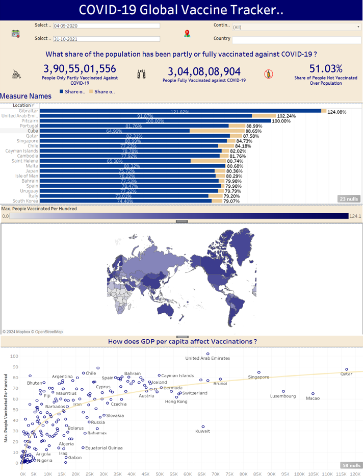

# **Global COVID-19 Vaccine Tracker**  
### **Comprehensive Insights on Worldwide Vaccination Progress**  

---

## **Overview**  
The **Global COVID-19 Vaccine Tracker** is an interactive Tableau visualization that provides an in-depth analysis of vaccination data across the globe. Designed for stakeholders, it highlights key vaccination metrics, trends, and disparities, enabling **data-driven decision-making** to enhance public health strategies.

---

## **Dashboard Snapshot**  

  
*Figure: Interactive Tableau Dashboard showcasing global vaccination metrics and trends*  

---

## **Key Metrics**  
- **Total People Partly or Fully Vaccinated**: 3,90,55,01,556  
- **Total People Fully Vaccinated**: 3,04,08,08,904  
- **Share of Unvaccinated Population**: 51.03%  

---

## **Dashboard Features**  

1. **Vaccination Statistics Overview**:  
   - Total and fully vaccinated populations displayed prominently for quick assessment.  

2. **Vaccination Rates by Location**:  
   - Bar chart displaying vaccination rates in top locations such as Gibraltar, United Arab Emirates, Pitcairn, and Portugal.  

3. **Global Vaccination Map**:  
   - World map visualizing vaccination rates with darker shades indicating higher vaccination rates.  

4. **Impact of GDP on Vaccinations**:  
   - Scatter plot showing the relationship between GDP per capita and vaccination rates, highlighting countries like Qatar, Singapore, and the United Arab Emirates.  

---

## **Insights**  

1. **High Vaccination Rates in Certain Regions**:  
   - Locations like Gibraltar and UAE have achieved high vaccination coverage.  

2. **Economic Influence on Vaccination Rates**:  
   - Higher GDP per capita often correlates with higher vaccination rates.  

3. **Global Disparities**:  
   - Significant differences in vaccination rates across different regions.  

4. **Vaccination Challenges**:  
   - Identifying areas with low vaccination rates to target public health efforts.  

5. **Overall Progress**:  
   - Majority of the world's population remains unvaccinated, indicating the need for continued efforts.

---

## **Strategic Recommendations**  

1. **Focus on Low-Vaccination Areas**:  
   - Prioritize vaccination campaigns in regions with low coverage.  

2. **Leverage Economic Strengths**:  
   - Utilize economic resources to enhance vaccination efforts in high GDP countries.  

3. **Improve Global Coordination**:  
   - Enhance international cooperation to ensure equitable vaccine distribution.  

4. **Monitor Trends and Adapt Strategies**:  
   - Continuously analyze vaccination trends to refine strategies.  

5. **Public Health Messaging**:  
   - Strengthen public health communication to address vaccine hesitancy.

---

## **Why This Dashboard Matters**  
1. **Interactive Visuals**:
      - Enables clear, actionable insights through detailed visualizations, making complex data easy to understand and use.
3. **Global Perspective**:
      - Offers a comprehensive overview of vaccination efforts across the globe, highlighting regional disparities and progress.
5. **Data-Driven Strategy**:
      - Facilitates informed decision-making by providing stakeholders with reliable and up-to-date vaccination data.
7. **Economic Insights**:
      - Reveals the impact of economic factors on vaccination rates, guiding resource allocation to improve vaccination coverage.
9. **Targeted Public Health Efforts**:
      - Identifies regions with low vaccination rates, enabling targeted campaigns to boost vaccine uptake.
11. **Equitable Vaccine Distribution**:
      - Supports efforts to enhance international cooperation and ensure fair vaccine distribution.
13. **Monitoring and Adaptation**:
      - Allows continuous tracking of vaccination trends, helping to refine public health strategies over time.
15. **Addressing Vaccine Hesitancy**:
      - Strengthens public health messaging to overcome vaccine hesitancy and improve overall vaccination rates.
---
By integrating these strategic insights, the **Global COVID-19 Vaccine Tracker** becomes an indispensable tool for driving effective public health initiatives and ensuring a more equitable and comprehensive vaccination effort worldwide.
