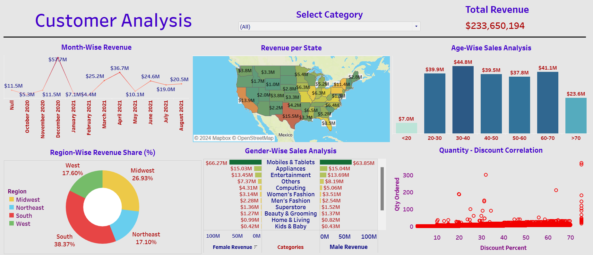

# **Customer Analysis Dashboard**  
### **In-Depth Revenue Analysis and Strategic Insights for Enhanced Customer Engagement**  

---

## **Overview**  
The **Customer Analysis Dashboard** is an interactive Tableau visualization that offers detailed insights into customer revenue data. Designed for stakeholders, it highlights key revenue metrics, trends, and opportunities, enabling **data-driven decision-making** to enhance customer engagement and business growth.

---

## **Dashboard Snapshot**  

  
*Figure: Interactive Tableau Dashboard showcasing key revenue metrics and trends for customer analysis*  

---

## **Key Metrics**  
- **Total Revenue**: $233,650,194  
- **Revenue Time Frame**: October 2020 to August 2021  

---

## **Dashboard Features**  

1. **Month-Wise Revenue**:  
   - Line graph displaying monthly revenue from October 2020 to August 2021. Key data points include:  
     - October 2020: $11.5M  
     - November 2020: $5.3M  
     - December 2020: $11.5M  
     - January 2021: $7.1M  
     - February 2021: $4.4M  
     - March 2021: $25.2M  
     - April 2021: $36.7M  
     - May 2021: $10.1M  
     - June 2021: $24.6M  
     - July 2021: $19.0M  
     - August 2021: $20.5M  

2. **Revenue per State**:  
   - US map color-coded by revenue, highlighting specific values for each state.  
     - Highest revenue: California ($15.5M)  
     - Other notable states: Texas ($13.9M), Florida ($8.5M), New York ($11.4M)  

3. **Region-Wise Revenue Share (%)**:  
   - Pie chart displaying revenue share by region:  
     - South: 38.37%  
     - Midwest: 26.93%  
     - West: 17.60%  
     - Northeast: 17.10%  

4. **Gender-Wise Sales Analysis**:  
   - Bar graph comparing revenue from different categories between female and male customers.  
     - Highest revenue categories: Mobiles & Tablets ($15.03M female, $15.04M male), Appliances ($13.45M female, $13.69M male)  

5. **Age-Wise Sales Analysis**:  
   - Bar graph showing revenue by age group:  
     - <20: $7.0M  
     - 20-30: $39.9M  
     - 30-40: $44.8M  
     - 40-50: $39.5M  
     - 50-60: $37.8M  
     - 60-70: $41.1M  
     - >70: $23.6M  

6. **Quantity - Discount Correlation**:  
   - Scatter plot showing the correlation between quantity ordered and discount percent.  

---

## **Insights**  

1. **Monthly Revenue Trends**:  
   - Significant revenue spikes in March and April 2021.  

2. **Geographical Revenue Distribution**:  
   - Highest revenue generated in California, followed by Texas and New York.  

3. **Regional Revenue Share**:  
   - The South region contributes the highest percentage of total revenue.  

4. **Gender-Based Preferences**:  
   - Similar revenue generation in Mobiles & Tablets and Appliances categories for both genders.  

5. **Age Group Analysis**:  
   - The 30-40 age group generates the highest revenue, indicating a key target demographic.  

6. **Quantity and Discount Relationship**:  
   - Discounts have a noticeable impact on the quantity of orders.  

---

## **Strategic Recommendations**  

1. **Focus on High-Revenue States**:  
   - Enhance marketing efforts in California, Texas, and New York to maximize revenue.  

2. **Leverage Regional Strengths**:  
   - Prioritize business strategies in the South region due to its substantial revenue share.  

3. **Target Key Demographics**:  
   - Tailor marketing campaigns to the 30-40 age group to increase engagement and sales.  

4. **Optimize Discount Strategies**:  
   - Develop targeted discount campaigns to boost order quantities effectively.  

5. **Address Gender-Specific Preferences**:  
   - Analyze and cater to the specific needs and preferences of both male and female customers.  

---

## **Why This Dashboard Matters**  
1. **Interactive Visuals**:
      - Provides clear, actionable insights through detailed visualizations, making complex data easy to interpret and use.
3. **Comprehensive Data**:
      - Offers a thorough analysis of revenue data across various dimensions, including time, geography, gender, and age group.
5. **Data-Driven Strategy**:
      - Empowers stakeholders to make informed decisions that drive business growth and enhance customer engagement.
7. **Targeted Marketing**:
      - Identifies key demographics and high-revenue regions, enabling more focused and effective marketing campaigns.
9. **Revenue Optimization**:
      - Highlights monthly revenue trends and regional performance, helping to optimize revenue strategies.
11. **Customer Insights**:
      - Provides a deep understanding of customer preferences and behaviors, allowing for personalized customer engagement.
13. **Discount Impact Analysis**:
      - Shows the correlation between discounts and order quantities, helping to fine-tune promotional strategies.
15. **Competitive Advantage**:
      - Keeps the business ahead by continuously adapting to market trends and customer needs based on reliable data insights.

---

By leveraging these insights, the **Customer Analysis Dashboard** serves as a vital tool for driving strategic decisions, optimizing revenue, and enhancing overall business performance.
