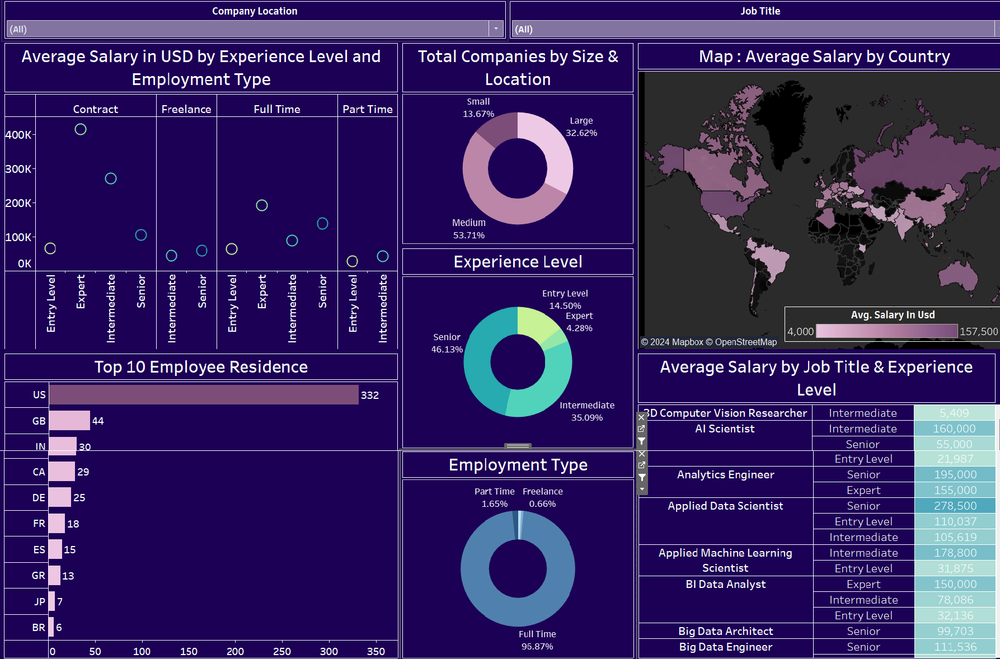

# **Global Tech Industry Salary Insights Dashboard**  
### **In-Depth Analysis of Salaries, Employment Types, and Experience Levels in the Tech Industry**  

---

## **Overview**  
The **Global Tech Industry Salary Insights Dashboard** is an interactive Tableau visualization offering detailed analysis of salary trends across various job titles, employment types, and experience levels in the tech industry. Designed for stakeholders, it highlights key metrics, trends, and disparities, enabling **data-driven decision-making** to optimize talent management and compensation strategies.

---

## **Dashboard Snapshot**  

  
*Figure: Interactive Tableau Dashboard showcasing global tech industry salary metrics and trends*  

---

## **Key Metrics**  
- **Average Salary in USD by Experience Level and Employment Type**:  
   - Contract, Freelance, Full Time, Part Time employment types  
   - Experience levels: Entry Level, Intermediate, Senior, Expert  

- **Total Companies by Size & Location**:  
   - Small: 13.67%  
   - Medium: 53.71%  
   - Large: 32.62%  

- **Experience Level**:  
   - Entry Level: 14.50%  
   - Intermediate: 35.09%  
   - Senior: 46.13%  
   - Expert: 4.28%  

- **Employment Type**:  
   - Full Time: 96.87%  
   - Part Time: 1.65%  
   - Freelance: 0.66%  

- **Top 10 Employee Residence**:  
   - US, GB, IN, CA, DE, FR, ES, GR, JP, BR  

- **Average Salary by Country**:  
   - Color gradient on world map indicating salary ranges from 4,000 to 157,500 USD  

- **Average Salary by Job Title & Experience Level**:  
   - AI Scientist, Analytics Engineer, Applied Data Scientist, Applied Machine Learning Scientist, BI Data Analyst, Big Data Architect, Big Data Engineer  

---

## **Dashboard Features**  

1. **Average Salary in USD by Experience Level and Employment Type**:  
   - Scatter plots showing salaries for Contract, Freelance, Full Time, and Part Time employment types across different experience levels.  

2. **Total Companies by Size & Location**:  
   - Pie chart showing the distribution of companies by size.  

3. **Experience Level Distribution**:  
   - Pie chart displaying the distribution of employees by experience level.  

4. **Employment Type Distribution**:  
   - Pie chart showing the distribution of employment types.  

5. **Top 10 Employee Residence**:  
   - Bar chart showing the top 10 countries where employees reside.  

6. **Map: Average Salary by Country**:  
   - World map showing average salaries by country with a color gradient.  

7. **Average Salary by Job Title & Experience Level**:  
   - Table listing various job titles and their corresponding average salaries based on experience levels.  

---

## **Insights**  

1. **Salaries by Experience and Employment Type**:  
   - Significant salary variations across different experience levels and employment types.  

2. **Company Size Distribution**:  
   - Medium-sized companies form the largest segment, followed by large and small companies.  

3. **Experience Level Trends**:  
   - Senior professionals dominate the workforce, with a noticeable proportion of intermediate and entry-level employees.  

4. **Employment Type Preferences**:  
   - Predominantly full-time employment, with minimal freelance and part-time engagements.  

5. **Top Employee Residences**:  
   - Majority of employees reside in the US, followed by the UK, India, and Canada.  

6. **Geographical Salary Distribution**:  
   - Higher average salaries in countries like the US, Germany, and Switzerland.  

7. **Job Title Salary Insights**:  
   - High salaries for roles such as Applied Data Scientist, AI Scientist, and Analytics Engineer, especially at senior and expert levels.  

---

## **Strategic Recommendations**  

1. **Optimize Salary Structures**:  
   - Align compensation strategies with industry standards and geographical benchmarks.  

2. **Focus on Senior Talent Retention**:  
   - Develop targeted retention programs for senior professionals.  

3. **Enhance Full-Time Employment Appeal**:  
   - Strengthen the value proposition for full-time employment to maintain high engagement.  

4. **Leverage Geographical Insights**:  
   - Utilize location-based salary insights to attract and retain talent in key markets.  

5. **Expand Global Talent Pool**:  
   - Explore opportunities to diversify the employee base across different regions.  

---

## **Why This Dashboard Matters**  
1. **Interactive Visuals**:  
      - Provides clear, actionable insights through detailed visualizations.

2. **Comprehensive Data**:  
      - Offers a thorough analysis of salary data across different dimensions.

3. **Data-Driven Strategy**:  
      - Empowers stakeholders to make informed decisions for talent management and compensation strategies.

4. **Optimize Compensation**:  
      - Helps align salary structures with industry standards and geographical benchmarks.

5. **Talent Retention**:  
      - Develops targeted retention programs for senior professionals, enhancing workforce stability.

6. **Geographical Insights**:  
      - Utilizes location-based salary data to attract and retain talent in key markets.

7. **Employment Type Analysis**:  
      - Highlights the distribution of employment types, aiding in workforce planning.

8. **Competitive Advantage**:  
      - Keeps companies ahead by continuously adapting to industry trends and salary benchmarks.

---

By leveraging these insights, the **Global Tech Industry Salary Insights Dashboard** transforms how stakeholders manage talent and compensation, driving strategic decisions that enhance organizational growth and competitiveness.
