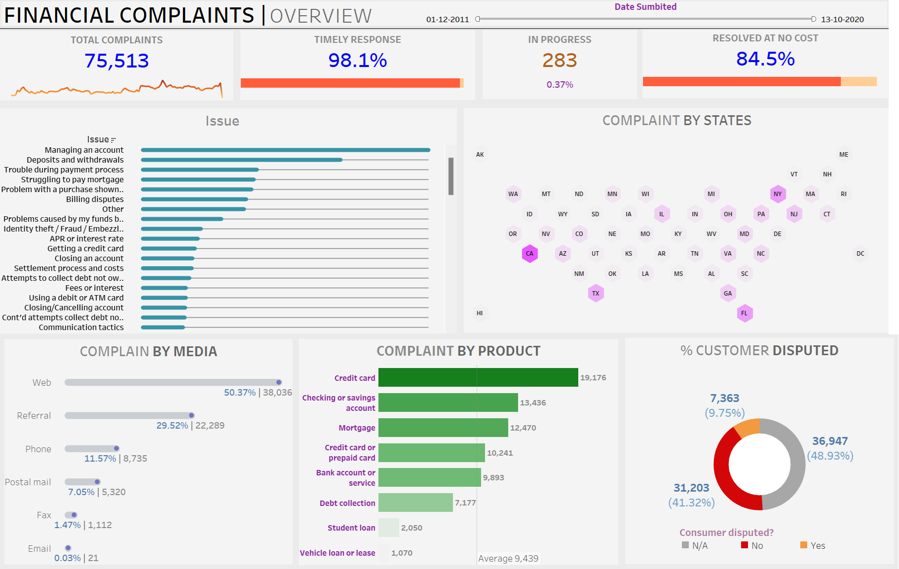

# **Financial Complaints Overview Dashboard**  
### **Comprehensive Analysis of Financial Complaints and Resolution Efficiency**  

---

## **Overview**  
The **Financial Complaints Overview Dashboard** is an interactive Tableau visualization that offers an in-depth analysis of financial complaints data. Designed for stakeholders, it highlights key metrics, trends, and insights, enabling **data-driven decision-making** to enhance customer service and resolution strategies.

---

## **Dashboard Snapshot**  

  
*Figure: Interactive Tableau Dashboard showcasing key financial complaint metrics and trends*  

---

## **Key Metrics**  
- **Total Complaints**: 75,513  
- **Timely Response**: 98.1%  
- **In Progress**: 283 (0.37%)  
- **Resolved at No Cost**: 84.5%  

---

## **Dashboard Features**  

1. **Issue Breakdown**:  
   - Categories of complaints including managing an account, deposits and withdrawals, trouble during payment process, and more.

2. **Complaints by States**:  
   - Hexagonal map highlighting complaint distribution across states, with high concentrations in California (CA) and Florida (FL).

3. **Complaints by Media**:  
   - Distribution of complaints by submission media:  
     - Web: 50.37% (38,036)  
     - Referral: 29.52% (22,289)  
     - Phone: 11.57% (8,735)  
     - Postal mail: 7.05% (5,320)  
     - Fax: 1.47% (1,112)  
     - Email: 0.03% (21)  

4. **Complaints by Product**:  
   - Analysis of complaints across different financial products:  
     - Credit card: 19,176  
     - Checking or savings account: 13,436  
     - Mortgage: 12,470  
     - Credit card or prepaid card: 10,241  
     - Bank account or service: 9,893  
     - Debt collection: 7,177  
     - Student loan: 2,050  
     - Vehicle loan or lease: 1,070  

5. **Customer Dispute Percentage**:  
   - Breakdown of customer dispute responses:  
     - Yes: 31,203 (41.32%)  
     - No: 36,947 (48.93%)  
     - N/A: 7,363 (9.75%)  

---

## **Insights**  

1. **High Timely Response Rate**:  
   - A significant 98.1% of complaints received a timely response, indicating efficient resolution processes.  

2. **Complaint Hotspots**:  
   - High concentration of complaints in California and Florida suggests regional focus areas.  

3. **Media Preferences**:  
   - The majority of complaints are submitted via the web, followed by referrals and phone submissions.  

4. **Product-Specific Issues**:  
   - Credit cards and checking/savings accounts generate the highest number of complaints.  

5. **Customer Dispute Trends**:  
   - A notable portion of complaints (41.32%) were disputed by customers, indicating areas for improvement in initial resolutions.  

---

## **Strategic Recommendations**  

1. **Enhance Resolution Processes**:  
   - Maintain and improve the high rate of timely responses to complaints.  

2. **Focus on High-Complaint Regions**:  
   - Target efforts in California and Florida to address regional issues.  

3. **Optimize Submission Channels**:  
   - Streamline web and referral complaint submission processes to enhance customer convenience.  

4. **Address High-Complaint Products**:  
   - Investigate and resolve recurring issues with credit cards and checking/savings accounts.  

5. **Improve Initial Resolutions**:  
   - Reduce the rate of customer disputes by enhancing the quality of initial complaint resolutions.  

---

## **Why This Dashboard Matters**  
1. **Interactive Visuals**:  
      - Provides clear, actionable insights through detailed visualizations, making complex data easy to interpret and use.

2. **Comprehensive Data**:  
      - Offers a thorough analysis of financial complaint data across different dimensions, ensuring no detail is overlooked.

3. **Data-Driven Strategy**:  
      - Empowers stakeholders to make informed decisions to improve customer service and resolution efficiency.

4. **Timely Responses**:  
      - Highlights high response rates, emphasizing efficient resolution processes and quick customer satisfaction.

5. **Regional Focus**:  
      - Identifies complaint hotspots, allowing targeted efforts in high-complaint regions like California and Florida.

6. **Customer Engagement**:  
      - Enhances understanding of customer preferences and pain points to improve service quality and customer relations.

7. **Product-Specific Insights**:  
      - Provides clarity on which products generate the most complaints, guiding targeted improvements and proactive measures.

8. **Dispute Reduction**:  
      - Helps in reducing customer disputes by improving the quality of initial resolutions, fostering trust and loyalty.

---

By leveraging these insights, the **Financial Complaints Overview Dashboard** not only enhances customer service and resolution strategies but also drives continuous improvement and operational excellence, ensuring a superior customer experience.
