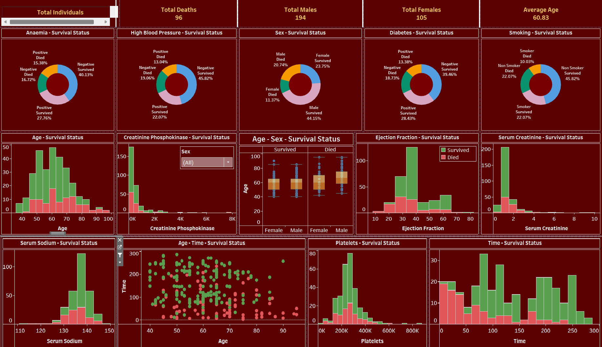

# **Medical Survival Analysis Dashboard**  
### **Comprehensive Insights into Survival Factors in a Medical Dataset**  

---

## **Overview**  
The **Medical Survival Analysis Dashboard** is an interactive Tableau visualization that provides detailed analysis of various factors affecting survival status in a medical dataset. Designed for healthcare professionals and researchers, it highlights key metrics, trends, and insights, enabling **data-driven decision-making** to improve patient care and outcomes.

---

## **Dashboard Snapshot**  

  
*Figure: Interactive Tableau Dashboard showcasing key survival metrics and trends in a medical dataset*  

---

## **Key Metrics**  
- **Total Individuals**: 299  
- **Total Deaths**: 96  
- **Total Males**: 194  
- **Total Females**: 105  
- **Average Age**: 60.83  

---

## **Dashboard Features**  

1. **Anaemia - Survival Status**:  
   - Pie chart showing the distribution of survival status based on anaemia.

2. **High Blood Pressure - Survival Status**:  
   - Pie chart showing the distribution of survival status based on high blood pressure.

3. **Sex - Survival Status**:  
   - Pie chart showing the distribution of survival status based on sex.

4. **Diabetes - Survival Status**:  
   - Pie chart showing the distribution of survival status based on diabetes.

5. **Smoking - Survival Status**:  
   - Pie chart showing the distribution of survival status based on smoking.

6. **Age - Survival Status**:  
   - Histogram showing the distribution of survival status based on age.

7. **Creatinine Phosphokinase - Survival Status**:  
   - Histogram showing the distribution of survival status based on creatinine phosphokinase levels.

8. **Age - Sex - Survival Status**:  
   - Box plot showing the distribution of survival status based on age and sex.

9. **Ejection Fraction - Survival Status**:  
   - Histogram showing the distribution of survival status based on ejection fraction.

10. **Serum Creatinine - Survival Status**:  
    - Histogram showing the distribution of survival status based on serum creatinine levels.

11. **Serum Sodium - Survival Status**:  
    - Histogram showing the distribution of survival status based on serum sodium levels.

12. **Age - Time - Survival Status**:  
    - Scatter plot showing the distribution of survival status based on age and time.

13. **Platelets - Survival Status**:  
    - Histogram showing the distribution of survival status based on platelet count.

14. **Time - Survival Status**:  
    - Histogram showing the distribution of survival status based on time.

---

## **Insights**  

1. **Anaemia and Survival**:  
   - The presence of anaemia has a noticeable impact on survival rates.

2. **High Blood Pressure Trends**:  
   - High blood pressure is correlated with lower survival rates.

3. **Gender Differences**:  
   - Survival rates differ significantly between males and females.

4. **Diabetes and Survival**:  
   - Diabetes is a factor influencing survival rates.

5. **Impact of Smoking**:  
   - Smoking status affects survival outcomes.

6. **Age Factor**:  
   - Older age groups show lower survival rates.

7. **Creatinine Phosphokinase Levels**:  
   - Higher levels are associated with lower survival.

8. **Ejection Fraction and Survival**:  
   - Lower ejection fraction is linked to reduced survival rates.

9. **Serum Creatinine and Sodium**:  
   - Abnormal levels are indicative of poorer survival outcomes.

10. **Platelet Count**:  
    - Variations in platelet count can impact survival.

11. **Time-related Survival Trends**:  
    - Time since diagnosis or treatment affects survival rates.

---

## **Strategic Recommendations**  

1. **Focus on High-Risk Groups**:  
   - Prioritize monitoring and intervention for patients with anaemia, high blood pressure, and diabetes.

2. **Gender-Specific Strategies**:  
   - Develop targeted approaches to address gender differences in survival rates.

3. **Smoking Cessation Programs**:  
   - Implement programs to reduce smoking among patients.

4. **Age-Related Interventions**:  
   - Tailor healthcare strategies to support older patients.

5. **Optimize Treatment Based on Lab Results**:  
   - Use creatinine phosphokinase, ejection fraction, and serum levels to guide treatment plans.

6. **Regular Monitoring**:  
   - Ensure regular follow-ups and monitoring to improve survival outcomes.

---

## **Why This Dashboard Matters**  
1. **Interactive Visuals**:  
      - Delivers clear, actionable insights through detailed and engaging visualizations.

2. **Comprehensive Data Analysis**:  
      - Provides an in-depth examination of various medical factors affecting survival, ensuring all critical aspects are considered.

3. **Data-Driven Healthcare**:  
      - Empowers healthcare professionals to make informed decisions that enhance patient care and improve survival outcomes.

4. **Targeted Interventions**:  
      - Identifies high-risk groups, enabling the development of focused monitoring and intervention strategies for conditions like anaemia, high blood pressure, and diabetes.

5. **Gender-Specific Strategies**:  
      - Highlights significant gender differences in survival rates, guiding the creation of tailored healthcare approaches.

6. **Smoking Cessation Impact**:  
      - Demonstrates the effect of smoking on survival, supporting the implementation of targeted cessation programs.

7. **Age-Specific Care**:  
      - Provides insights into the survival rates of different age groups, helping tailor healthcare strategies for older patients.

8. **Laboratory Results Utilization**:  
      - Uses key lab results such as creatinine phosphokinase and ejection fraction to optimize treatment plans.

9. **Continuous Monitoring**:  
      - Emphasizes the importance of regular follow-ups and monitoring to improve long-term survival outcomes.

---

By integrating these strategic insights, the **Medical Survival Analysis Dashboard** transforms how healthcare professionals and researchers approach patient care, driving improvements in survival rates and overall health outcomes.

