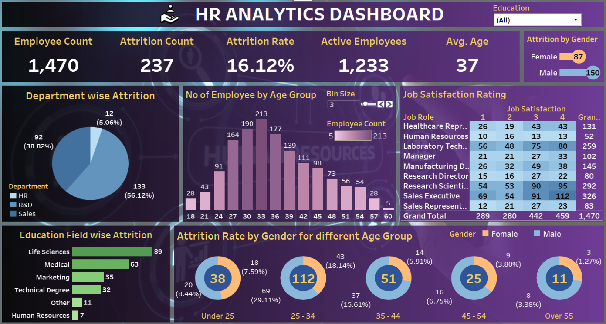

# **HR Analytics Dashboard**  
### **Comprehensive Analysis of Employee Data for Strategic HR Decision-Making**  

---

## **Overview**  
The **HR Analytics Dashboard** is an interactive Tableau visualization that provides in-depth insights into employee data, including attrition rates, job satisfaction, and demographics. Designed for HR professionals and stakeholders, it highlights key metrics and trends, enabling **data-driven decision-making** to enhance employee engagement and retention.

---

## **Dashboard Snapshot**  

  
*Figure: Interactive Tableau Dashboard showcasing key HR metrics and trends*  

---

## **Key Metrics**  
- **Employee Count**: 1,470  
- **Attrition Count**: 237  
- **Attrition Rate**: 16.12%  
- **Active Employees**: 1,233  
- **Average Age**: 37  
- **Attrition by Gender**: Female: 87, Male: 150  

---

## **Dashboard Features**  

1. **Department-wise Attrition**:  
   - Breakdown of attrition rates by department: HR (5.06%), R&D (38.82%), Sales (56.12%).

2. **Number of Employees by Age Group**:  
   - Bar chart displaying employee counts across age groups, with bins ranging from 18 to 60.

3. **Job Satisfaction Rating**:  
   - Analysis of job satisfaction ratings from 1 to 4 across different job roles.

4. **Education Field-wise Attrition**:  
   - Attrition rates by education field: Life Sciences (89), Medical (63), Marketing (35), Technical Degree (32), Other (11), Human Resources (7).

5. **Attrition Rate by Gender for Different Age Groups**:  
   - Analysis of attrition rates by gender and age groups:  
     - Under 25: 7.59%  
     - 25 - 34: 29.11%  
     - 35 - 44: 15.61%  
     - 45 - 54: 6.75%  
     - Over 55: 3.38%  

---

## **Insights**  

1. **High Attrition in Sales and R&D Departments**:  
   - The Sales and R&D departments have the highest attrition rates, indicating areas for targeted interventions.

2. **Age Distribution of Employees**:  
   - A significant number of employees are in the age group of 25-34, which could be a key focus area for retention strategies.

3. **Job Satisfaction Variability**:  
   - Differences in job satisfaction ratings across various job roles highlight areas for improvement.

4. **Education Field Impact on Attrition**:  
   - Life Sciences and Medical fields show higher attrition rates, suggesting a need for tailored retention strategies.

5. **Gender and Age Group Attrition**:  
   - Younger employees and males have higher attrition rates, indicating specific demographics that may require focused retention efforts.

---

## **Strategic Recommendations**  

1. **Focus on High-Attrition Departments**:  
   - Implement targeted retention programs in the Sales and R&D departments to reduce attrition rates.

2. **Enhance Employee Engagement for Younger Workforce**:  
   - Develop engagement and development initiatives tailored for employees in the age group of 25-34.

3. **Improve Job Satisfaction**:  
   - Address factors contributing to lower job satisfaction in specific roles to improve overall employee morale.

4. **Tailored Retention Strategies by Education Field**:  
   - Create retention strategies specific to employees from Life Sciences and Medical fields to reduce attrition.

5. **Address Gender-Specific Attrition Trends**:  
   - Develop gender-specific retention programs, especially targeting younger male employees, to reduce attrition rates.

---

## **Why This Dashboard Matters**  
1. **Interactive Visuals**:  
      - Provides clear, actionable insights through detailed and engaging visualizations.

2. **Comprehensive Data**:  
      - Offers a thorough analysis of employee data across various dimensions, ensuring all aspects are considered.

3. **Data-Driven HR Strategy**:  
      - Empowers HR professionals to make informed decisions that enhance employee engagement and retention.

4. **Targeted Retention Efforts**:  
      - Identifies high-attrition departments, enabling the creation of focused retention programs to reduce turnover.

5. **Employee Engagement**:  
      - Highlights key demographics, such as younger employees, to tailor engagement and development initiatives.

6. **Job Satisfaction Improvement**:  
      - Pinpoints areas with lower job satisfaction, guiding efforts to boost employee morale and satisfaction.

7. **Education Field Insights**:  
      - Provides specific attrition data by education field, allowing for customized retention strategies.

8. **Gender-Specific Approaches**:  
      - Addresses gender-related attrition trends, particularly among younger male employees, to develop effective retention plans.

---

By leveraging these strategic insights, the **HR Analytics Dashboard** transforms HR practices, driving improvements in employee retention, engagement, and overall organizational health.

