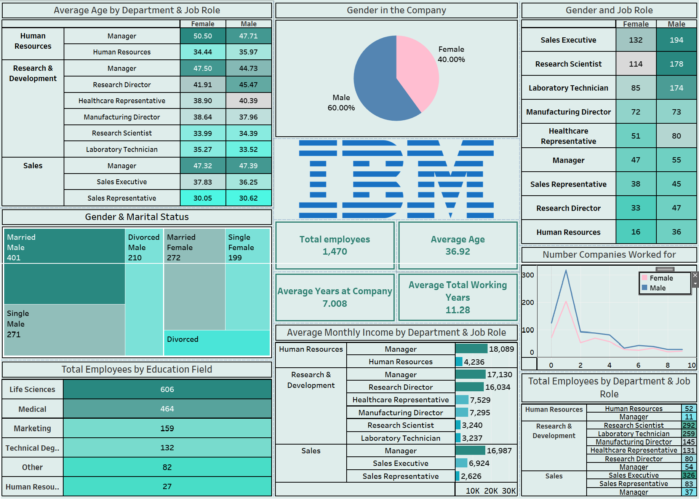

# **IBM Employee Overview Dashboard**  
### **Comprehensive Analysis of Employee Demographics, Roles, and Compensation at IBM**  

---

## **Overview**  
The **IBM Employee Overview Dashboard** is an interactive Tableau visualization providing detailed insights into the demographics, roles, and compensation of employees at IBM. Designed for HR professionals and stakeholders, it highlights key metrics and trends, enabling **data-driven decision-making** to enhance workforce management and strategic planning.

---

## **Dashboard Snapshot**  

  
*Figure: Interactive Tableau Dashboard showcasing key metrics and trends for IBM employees*  

---

## **Key Metrics**  
- **Total Employees**: 1,470  
- **Average Age**: 37  
- **Average Years at Company**: 7  
- **Average Total Working Years**: 11  

---

## **Dashboard Features**  

1. **Average Age by Department and Job Role**:  
   - Analysis of average employee age across various departments and job roles.

2. **Gender Distribution**:  
   - Pie chart showing the gender distribution within the company.

3. **Gender and Job Role Distribution**:  
   - Breakdown of gender representation across different job roles.

4. **Gender and Marital Status**:  
   - Analysis of the marital status distribution by gender.

5. **Total Employees by Education Field**:  
   - Bar chart showing the number of employees across different education fields.

6. **Average Monthly Income by Department and Job Role**:  
   - Detailed analysis of average monthly income segmented by department and job role.

7. **Number of Companies Worked For by Gender**:  
   - Distribution of the number of companies employees have worked for, segmented by gender.

---

## **Insights**  

1. **Age and Experience**:  
   - The average age of employees is 37, with significant variations across departments and job roles.

2. **Gender Representation**:  
   - Gender distribution analysis highlights the male and female representation within different roles and departments.

3. **Education Backgrounds**:  
   - A diverse range of education fields is represented among employees, with significant contributions from technical and non-technical backgrounds.

4. **Income Trends**:  
   - Average monthly income varies across departments and job roles, providing insights into compensation structures.

5. **Career Mobility**:  
   - Analysis of the number of companies worked for by gender offers insights into employee career paths and mobility.

---

## **Strategic Recommendations**  

1. **Enhance Diversity**:  
   - Implement initiatives to promote gender diversity across various job roles and departments.

2. **Optimize Compensation Structures**:  
   - Review and adjust compensation strategies to ensure equity and competitiveness across different roles.

3. **Support Career Development**:  
   - Develop programs to support career growth and mobility, tailored to the diverse educational backgrounds of employees.

4. **Focus on Employee Retention**:  
   - Implement strategies to retain experienced employees, leveraging insights into average tenure and job satisfaction.

5. **Strengthen Workforce Planning**:  
   - Utilize demographic and compensation insights to inform strategic workforce planning and talent management.

---

## **Why This Dashboard Matters**  
- **Interactive Visuals**: Provides clear, actionable insights through detailed visualizations.  
- **Comprehensive Data**: Offers a thorough analysis of employee demographics, roles, and compensation.  
- **Data-Driven Strategy**: Empowers HR professionals to make informed decisions for effective workforce management and strategic planning.

