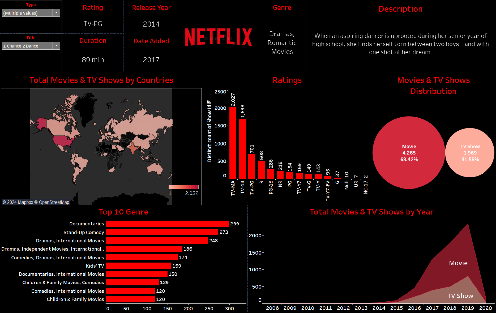

# **Netflix Content Analysis Dashboard**  
### **In-Depth Insights into Netflix's Movies and TV Shows Distribution**  

---

## **Overview**  
The **Netflix Content Analysis Dashboard** is an interactive Tableau visualization providing comprehensive insights into the distribution and characteristics of Netflix's movies and TV shows. Designed for stakeholders, it highlights key metrics, trends, and geographical availability, enabling **data-driven decision-making** to enhance content strategy and user engagement.

---

## **Dashboard Snapshot**  

  
*Figure: Interactive Tableau Dashboard showcasing key metrics and trends for Netflix's movies and TV shows*  

---

## **Key Metrics**  
- **Total Content**: 6,234  
   - Movies: 4,265 (68.42%)  
   - TV Shows: 1,969 (31.58%)  
- **Top Genre**: Documentaries (299)  
- **Most Common Rating**: TV-MA (2,027)  
- **Content Addition**: Steady increase from 2008 to 2020  
- **Global Availability**: Varies significantly by country (1 to 2,032 titles)

---

## **Dashboard Features**  

1. **Content by Genre**:  
   - Bar chart displaying the top 10 genres, with Documentaries being the most common and Children & Family Movies the least common among the top genres.

2. **Content Ratings Distribution**:  
   - Bar chart showing the distribution of content ratings, with TV-MA being the most frequent and NC-17 the least frequent.

3. **Movies vs. TV Shows**:  
   - Pie chart illustrating the proportion of movies to TV shows on Netflix.

4. **Global Content Distribution**:  
   - World map indicating the number of movies and TV shows available in each country, with a color gradient showing the range from 1 to 2,032 titles.

5. **Yearly Content Addition**:  
   - Area chart showcasing the total number of movies and TV shows added per year from 2008 to 2020, highlighting trends in content addition over time.

6. **Detailed Content Information**:  
   - Example of a specific movie (e.g., "1 Chance 2 Dance") with details including rating, release year, duration, genre, and a brief description.

---

## **Insights**  

1. **Genre Trends**:  
   - Documentaries dominate as the top genre, indicating a significant focus on informational content.

2. **Rating Distribution**:  
   - TV-MA is the most common rating, reflecting a substantial amount of mature content on Netflix.

3. **Content Composition**:  
   - Movies make up the majority of Netflix's content, though TV shows also represent a significant portion.

4. **Geographical Availability**:  
   - The availability of content varies widely by country, with some regions having access to a significantly larger library.

5. **Content Growth**:  
   - There has been a steady increase in the number of movies and TV shows added to Netflix over the years, with noticeable spikes in certain years.

---

## **Strategic Recommendations**  

1. **Expand Genre Diversity**:  
   - Enhance the variety of genres to cater to a broader audience and fill gaps in the current content library.

2. **Optimize Content for Ratings**:  
   - Analyze audience preferences for different ratings to align new content acquisitions and productions with viewer demand.

3. **Increase Global Availability**:  
   - Work on licensing and content distribution strategies to provide a more uniform library across different regions.

4. **Leverage Popular Content Trends**:  
   - Capitalize on the popularity of Documentaries and TV-MA rated content by producing similar high-quality shows and movies.

5. **Monitor Content Addition Trends**:  
   - Continuously analyze yearly content addition trends to identify optimal times for launching new content.

---

## **Why This Dashboard Matters**  
1. **Engaging Visuals**:  
      - Presents complex data through interactive and easy-to-understand visualizations, making insights accessible to all stakeholders.

2. **Comprehensive Content Analysis**:  
      - Provides an in-depth examination of Netflix's vast library, offering detailed insights into the distribution and characteristics of movies and TV shows.

3. **Informed Content Strategy**:  
      - Empowers stakeholders with data-driven insights to refine content strategies, ensuring alignment with viewer preferences and market trends.

4. **Genre Insights**:  
      - Highlights the dominance and gaps in genre distribution, enabling targeted content acquisitions and production to diversify the library.

5. **Audience Targeting**:  
      - Analyzes content ratings and popularity to help tailor offerings that meet the diverse preferences of Netflix's global audience.

6. **Global Reach**:  
      - Maps the geographical availability of content, identifying regions with limited access and guiding strategic expansion efforts.

7. **Content Growth Monitoring**:  
      - Tracks yearly content additions, allowing for strategic planning around content launches to maximize viewer engagement.

8. **Maximizing Engagement**:  
      - Focuses on popular content trends to produce high-quality shows and movies that resonate with the audience, boosting viewer retention.

9. **Strategic Expansion**:  
      - Provides insights to optimize content distribution and expand Netflix's reach, maintaining its competitive edge in the streaming industry.

---

By leveraging these insights, the **Netflix Content Analysis Dashboard** transforms content strategy, enabling Netflix to enhance its library, meet viewer demands, and maintain its competitive edge in the streaming industry.
