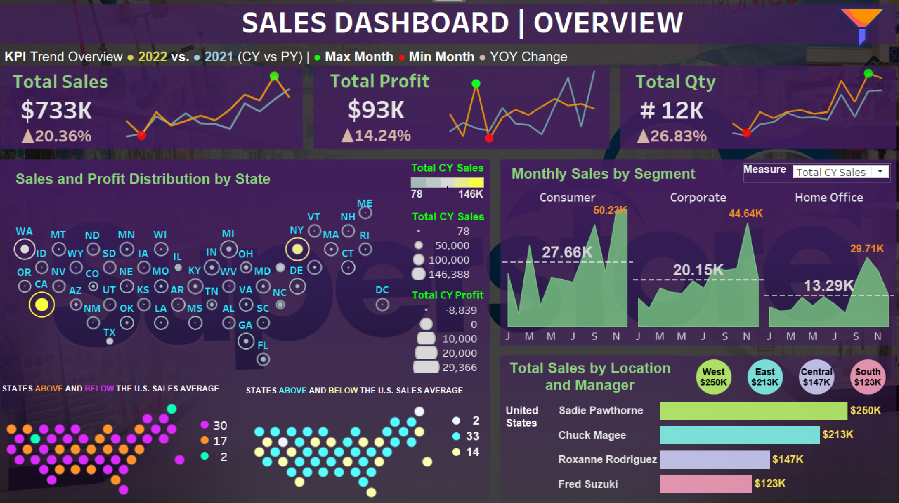

# **Sales Performance Dashboard 2022**  
### **Interactive Insights for Strategic Sales Growth**  

---

## **Overview**  
The **Sales Performance Dashboard 2022** is an interactive Tableau visualization that offers comprehensive insights into sales performance metrics. Designed for stakeholders, it highlights key sales metrics, performance trends, and growth opportunities, enabling **data-driven decision-making** to drive sales growth.

---

## **Dashboard Snapshot**  

  
*Figure: Interactive Tableau Dashboard showcasing key sales metrics and trends*  

---

## **Key Metrics**  
- **Total Sales**: $733K, with a 20.36% increase  
- **Total Profit**: $93K, with a 14.24% increase  
- **Total Quantity**: 12K, with a 26.83% increase  

---

## **Dashboard Features**  

1. **Sales and Profit Distribution by State**:  
   - A map showing the distribution of sales and profit across different states.

2. **Monthly Sales by Segment**:  
   - Bar charts displaying monthly sales performance across different segments:  
     - Consumer: $50.23K  
     - Corporate: $44.64K  
     - Home Office: $29.71K  

3. **Total Sales by Location and Manager**:  
   - Detailed analysis of total sales by location and sales manager:  
     - **Regions**:  
       - West: $250K  
       - East: $213K  
       - Central: $147K  
       - South: $123K  
     - **Managers**:  
       - Sadie Pawthorne: $250K  
       - Chuck Magee: $213K  
       - Roxanne Rodriguez: $147K  
       - Fred Suzuki: $123K  

---

## **Insights**  

1. **Significant Sales Growth**:  
   - Total sales have increased by 20.36%, indicating robust growth.

2. **Profit Increase**:  
   - Total profit has grown by 14.24%, reflecting effective sales strategies and cost management.

3. **Quantity Sold**:  
   - The total quantity sold has increased by 26.83%, suggesting higher product demand.

4. **Regional Sales Performance**:  
   - The West region leads in total sales, followed by the East, Central, and South regions.

5. **Top Sales Managers**:  
   - Sadie Pawthorne and Chuck Magee are leading in sales performance.

6. **Segment Performance**:  
   - The Consumer segment shows the highest sales, followed by Corporate and Home Office segments.

---

## **Strategic Recommendations**  

1. **Focus on High-Performing Regions**:  
   - Leverage the strengths of the West and East regions to drive further growth.

2. **Enhance Profitability**:  
   - Identify strategies to maintain and increase profit margins.

3. **Boost Product Demand**:  
   - Develop marketing campaigns to sustain the increase in product demand.

4. **Support Top Sales Managers**:  
   - Provide additional resources and support to top-performing sales managers to maximize their effectiveness.

5. **Optimize Segment Strategies**:  
   - Tailor sales strategies to strengthen the performance of all segments, particularly focusing on areas of improvement.

---

## **Why This Dashboard Matters**  
1. **Actionable Visual Insights**:  
      - Transforms complex data into easy-to-understand visualizations that drive actionable insights for decision-makers.

2. **Comprehensive Sales Analysis**:  
      - Offers a detailed breakdown of sales performance, revealing trends and opportunities across different regions, segments, and managers.

3. **Strategic Growth Enabler**:  
      - Provides data-driven insights that empower stakeholders to devise strategies for sustainable sales growth and profitability.

4. **Regional Performance Tracking**:  
      - Highlights regional sales performance, allowing targeted strategies to enhance growth in high-performing areas.

5. **Managerial Effectiveness**:  
      - Identifies top-performing sales managers, enabling targeted support and resource allocation to boost overall sales performance.

6. **Enhanced Profit Margins**:  
      - Offers insights into profit trends, helping businesses maintain and increase profitability through strategic planning.

7. **Segment-Specific Strategies**:  
      - Breaks down sales by segments, providing clarity on performance and guiding segment-specific strategies for improvement.

---

By leveraging these insights, the **Sales Performance Dashboard 2022** becomes a powerful tool for driving strategic sales growth, optimizing regional performance, and enhancing overall profitability.
